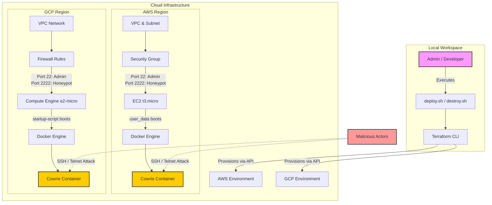

# Scalable Multi-Cloud Honeynet Framework 

[](https://summerofcode.withgoogle.com/)
[](#)
[](https://www.terraform.io/)
[](#)
[](#)

A Google Summer of Code 2026 project developed under **C2SI**.

This project aims to build a scalable, cloud-native framework for deploying distributed honeypots across multiple cloud providers using Terraform. The framework focuses on automating infrastructure provisioning, simplifying honeypot deployment, and providing a foundation for collecting threat intelligence from multiple geographic regions.

The project is being developed incrementally throughout the GSoC coding period, with new features and improvements added each week.

---

## 📑 Table of Contents

- [Project Status](#-project-status)
- [Project Goals](#-project-goals)
- [Project Information](#-project-information)
- [High-Level Architecture](#-high-level-architecture)
- [Technologies Used](#-technologies-used)
- [Repository Structure](#-repository-structure)
- [Quick Start](#-quick-start)
- [Weekly Progress](#-weekly-progress)
- [Planned Work](#-planned-work)

---

## 🚧 Project Status

This project is currently under active development as part of **Google Summer of Code 2026**.

The repository will continue to evolve throughout the coding period as additional features, improvements, and documentation are added.

---

## 🎯 Project Goals

The primary goals of this project are to:

- Automate honeypot deployment using Terraform
- Support deployments across multiple cloud providers
- Enable multi-region infrastructure provisioning
- Simplify deployment through Bash wrapper scripts
- Build a reusable and modular Infrastructure-as-Code (IaC) framework
- Lay the foundation for centralized threat intelligence collection

---

## 👨‍💻 Project Information

| | |
|---|---|
| **Google Summer of Code** | 2026 |
| **Organization** | C2SI |
| **Project** | Scalable Multi-Cloud Honeynet Framework |
| **Contributor** | Trisha (@TrishaG189) |

### Mentors

- Charitha Elvitigala
- DWath

---

## 🏗️ High-Level Architecture



---

## 🛠️ Technologies Used

- Terraform
- Amazon Web Services (AWS)
- Google Cloud Platform (GCP)
- Docker
- Cowrie Honeypot
- Bash

---

## 📂 Repository Structure

```text
.
├── v3/                  # AWS Infrastructure
├── v4/                  # Google Cloud Infrastructure
├── deploy.sh            # Deployment wrapper
├── destroy.sh           # Cleanup wrapper
├── admin_key.pub        # Public SSH key
└── README.md
```

---

## 🚀 Quick Start

### 1. Clone the repository

```bash
git clone https://github.com/TrishaG189/honeynet-framework.git
cd honeynet-framework
```

### 2. Configure cloud credentials

AWS

```bash
aws configure
```

Google Cloud

```bash
gcloud auth application-default login
```

### 3. Deploy

```bash
chmod +x deploy.sh
./deploy.sh
```

Follow the interactive prompts to select the cloud provider and deployment region.

### 4. Destroy

To avoid unnecessary cloud charges, destroy the infrastructure once testing is complete.

```bash
chmod +x destroy.sh
./destroy.sh
```

---

## 📅 Weekly Progress

### Week 1

- Set up the development environment
- Explored the reference project structure
- Created the initial Terraform project
- Provisioned a basic AWS infrastructure
- Added deployment and cleanup scripts

### Week 2

- Automated VM initialization using `user_data`
- Installed Docker during instance boot
- Deployed the Cowrie honeypot automatically
- Verified SSH interaction with the honeypot

### Week 3

- Refactored Terraform into reusable modules
- Separated networking and compute resources
- Added variables and outputs
- Improved the project structure for scalability

### Week 4

- Extended deployments to multiple AWS regions
- Added region selection support
- Updated deployment scripts for multi-region provisioning
- Validated deployments across multiple regions

### Week 5

- Added Google Cloud Platform support
- Implemented equivalent networking and compute resources
- Automated Cowrie deployment on GCP
- Extended deployment scripts for cloud selection

---

## 📌 Planned Work

### Week 6

- Configure remote Terraform state
- Implement state locking
- Refine repository structure

### Week 7

- Centralized log collection

### Week 8

- Threat intelligence enrichment

### Week 9

- Monitoring and observability

### Week 10

- Documentation improvements

### Week 11

- Testing and validation

### Week 12

- Final polishing and project completion

---

## 📜 License

This project is being developed as part of **Google Summer of Code 2026** under **C2SI**.
