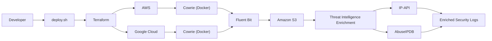
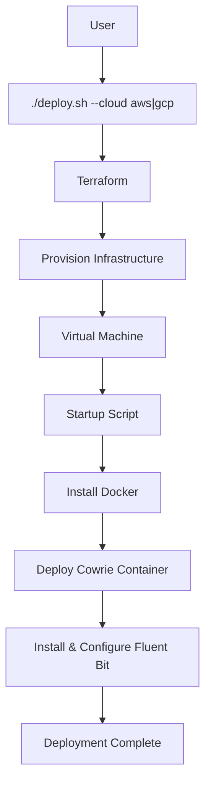
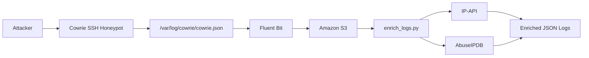

# honeynet-framework

> Infrastructure as Code framework for deploying distributed Cowrie honeypots across AWS and Google Cloud using Terraform, centralized log collection with Fluent Bit, and automated threat intelligence enrichment.


---

## About the Project

This repository contains the implementation of the **Scalable Multi-Cloud Honeynet Framework**, developed as part of **Google Summer of Code 2026** under **C2SI**.

The project provides an Infrastructure as Code (IaC) framework for deploying **Cowrie SSH honeypots** across multiple cloud providers using **Terraform**. It automates infrastructure provisioning, honeypot deployment, centralized log collection, and threat intelligence enrichment to create a scalable environment for collecting and analyzing attack telemetry.

Instead of manually configuring cloud infrastructure and security monitoring components, the framework enables repeatable deployments through a single deployment workflow while maintaining support for multiple cloud providers.

| Project Information | |
|--------------------|-------------------------------|
| **Program** | Google Summer of Code 2026 |
| **Organization** | C2SI |
| **Project** | Scalable Multi-Cloud Honeynet Framework |
| **Contributor** | Trisha G |

---

## Why This Project?

Modern cyber attacks originate from diverse geographic locations and frequently target publicly exposed services. Collecting realistic attack telemetry requires infrastructure that can be deployed quickly, managed consistently, and expanded across cloud providers.

This project addresses that need by combining infrastructure automation with centralized logging and automated threat intelligence enrichment.

The framework allows users to:

- Deploy Cowrie honeypots on AWS or Google Cloud using Terraform
- Automate infrastructure provisioning and cleanup
- Centralize honeypot logs using Fluent Bit
- Store collected telemetry in Amazon S3
- Enrich attacker IP addresses using external threat intelligence services
- Maintain reusable and modular Terraform configurations

---

## Key Features

| Category | Features |
|----------|----------|
| **Infrastructure** | Automated provisioning using Terraform |
| **Cloud Support** | AWS and Google Cloud |
| **Deployment** | Bash-based deployment and cleanup scripts |
| **Honeypot** | Cowrie deployed in Docker containers |
| **Logging** | Centralized log forwarding with Fluent Bit |
| **Storage** | Amazon S3 for centralized log storage |
| **Threat Intelligence** | IP-API and AbuseIPDB integration |
| **Automation** | VM bootstrap using startup scripts |
| **Terraform** | Modular infrastructure design |
| **Remote State** | Support for Terraform remote backend |

---

## System Architecture



The deployment process begins with the deployment script, which provisions infrastructure using Terraform on the selected cloud provider. Each virtual machine installs and starts a Dockerized Cowrie honeypot during initialization. Cowrie generates structured JSON logs that are collected by Fluent Bit and forwarded to a centralized Amazon S3 bucket. A Python-based enrichment module then augments collected events with geolocation and IP reputation data obtained from IP-API and AbuseIPDB.

---

## Technology Stack

| Category | Technologies |
|----------|--------------|
| **Infrastructure as Code** | Terraform |
| **Cloud Platforms** | AWS, Google Cloud |
| **Programming Language** | Python |
| **Automation** | Bash |
| **Containerization** | Docker |
| **Honeypot** | Cowrie |
| **Log Collection** | Fluent Bit |
| **Storage** | Amazon S3 |
| **Threat Intelligence** | IP-API, AbuseIPDB |
| **Version Control** | Git, GitHub |

---

> [!NOTE]
> A single deployment targets either AWS or Google Cloud using the deployment script. Independent deployments can coexist simultaneously across supported cloud providers.

> [!TIP]
> The infrastructure is modular, making it straightforward to extend the framework with additional cloud providers, honeypot types, or log processing pipelines in future iterations.
>## Repository Structure

The repository is organized into infrastructure definitions, deployment scripts, and log enrichment components.

```text
honeynet-framework/
├── enrichment/
│   └── enrich_logs.py          # Threat intelligence enrichment
├── v1/                         # Initial Terraform implementation
├── v2/                         # Modular Terraform configuration
├── v3/                         # AWS deployment with remote backend
├── v4/                         # Google Cloud deployment
├── deploy.sh                   # Deployment automation
├── destroy.sh                  # Resource cleanup
├── .gitignore
└── README.md
```

---

## Prerequisites

Before deploying the framework, ensure the following software is installed and configured.

| Software | Version |
|----------|---------|
| Terraform | 1.5 or later |
| Docker | Latest stable release |
| Python | 3.10 or later |
| Bash | GNU Bash |
| Git | Latest stable release |

You will also need:

- An AWS account with programmatic access
- A Google Cloud project with billing enabled
- Terraform CLI configured locally
- AWS CLI configured (for AWS deployments)
- Google Cloud SDK configured (for Google Cloud deployments)

---

## Cloud Credentials

### AWS

Configure your AWS credentials before deploying infrastructure.

```bash
aws configure
```

Provide:

- AWS Access Key ID
- AWS Secret Access Key
- Default Region
- Output Format

Terraform automatically uses these credentials during deployment.

---

### Google Cloud

Authenticate using the Google Cloud SDK.

```bash
gcloud auth application-default login
```

Set your active project.

```bash
gcloud config set project <PROJECT_ID>
```

---

## Deployment

The framework supports deployments to **one cloud provider per execution**.

Select the provider using the `--cloud` flag.

### Deploy to AWS

```bash
./deploy.sh --cloud aws
```

### Deploy to Google Cloud

```bash
./deploy.sh --cloud gcp
```

Although each execution targets a single provider, AWS and Google Cloud deployments can coexist independently once provisioned.

---

## Infrastructure Provisioning

The deployment workflow performs the following operations automatically.

1. Initializes the Terraform working directory.
2. Provisions cloud networking resources.
3. Creates the required virtual machine.
4. Executes the startup script during instance initialization.
5. Installs Docker on the virtual machine.
6. Pulls and starts the Cowrie Docker container.
7. Installs and configures Fluent Bit.
8. Begins forwarding Cowrie logs to the centralized Amazon S3 bucket.

No manual configuration is required after the deployment process completes successfully.

---

## Cowrie Deployment

Cowrie is deployed as a Docker container during virtual machine initialization.

```bash
docker run \
-p 2222:2222 \
-v /var/log/cowrie:/cowrie/cowrie-git/var/log/cowrie \
-d cowrie/cowrie
```

The honeypot listens on port **2222** and continuously records SSH interaction logs in JSON format.

---

## Centralized Logging

Cowrie stores structured JSON logs at:

```text
/var/log/cowrie/cowrie.json
```

Fluent Bit continuously monitors this file and forwards newly generated events to the centralized Amazon S3 bucket.

This architecture separates log generation from log storage while enabling centralized analysis across multiple deployments.

---

## Threat Intelligence Enrichment

After collection, logs can be enriched using the Python enrichment module.

```bash
python enrichment/enrich_logs.py
```

Each attacker IP is enriched using:

| Service | Information Retrieved |
|----------|-----------------------|
| IP-API | Country, City, ISP, ASN |
| AbuseIPDB | Abuse Confidence Score, Reputation |

The enriched output provides additional context for attack analysis beyond the raw Cowrie events.

---

## Destroying Infrastructure

To remove all provisioned resources, run:

```bash
./destroy.sh
```

This destroys the deployed cloud infrastructure while preserving locally stored project files.
>
> ## Deployment Workflow

The deployment process is fully automated through the provided deployment script. Based on the selected cloud provider, Terraform provisions the required infrastructure, initializes the virtual machine, installs all dependencies, and starts the Cowrie honeypot without manual intervention.



The deployment script abstracts the underlying infrastructure provisioning process, enabling reproducible deployments across supported cloud providers using a consistent workflow.

---

## Log Processing Pipeline

Once the honeypot is deployed, attack events flow through a centralized collection and enrichment pipeline.



Each authentication attempt or command executed against the honeypot is recorded by Cowrie as structured JSON. Fluent Bit continuously monitors the generated log file and forwards new events to the centralized Amazon S3 bucket. The enrichment module processes these events and augments attacker IP addresses with geolocation and reputation data obtained from external threat intelligence services.

---

## Threat Intelligence Enrichment

Raw honeypot logs provide valuable information about attacker activity, but they do not include contextual information about the origin or reputation of the attacking host.

The enrichment module extends each collected event by querying external threat intelligence providers.

| Provider | Enriched Information |
|----------|----------------------|
| **IP-API** | Country, Region, City, ISP, ASN |
| **AbuseIPDB** | Abuse Confidence Score and IP Reputation |

This additional metadata enables more effective analysis by providing geographic context and historical reputation information for observed attacker IP addresses.

---

## Implementation Progress

The project has been developed incrementally throughout Google Summer of Code 2026.

| Week | Milestone | Status |
|------|-----------|:------:|
| 1 | AWS Infrastructure Provisioning | ✅ |
| 2 | Automated Cowrie Deployment | ✅ |
| 3 | Modular Terraform Configuration | ✅ |
| 4 | Multi-Region AWS Deployment | ✅ |
| 5 | Google Cloud Support | ✅ |
| 6 | Terraform Remote State | ✅ |
| 7 | Centralized Log Collection | ✅ |
| 8 | Threat Intelligence Enrichment | ✅ |

---

## Current Capabilities

The framework currently supports the following functionality.

### Infrastructure

- Terraform-based Infrastructure as Code
- Modular Terraform configuration
- AWS deployment
- Google Cloud deployment
- Cloud selection through deployment script
- Remote Terraform state support

### Honeypot

- Automated Cowrie deployment
- Docker-based container execution
- Startup script automation

### Logging

- Structured JSON logging
- Fluent Bit log collection
- Centralized Amazon S3 storage

### Threat Intelligence

- Automated enrichment pipeline
- IP geolocation
- ASN lookup
- ISP identification
- Abuse confidence scoring

---

## Roadmap

The following milestones are planned for the remaining development period.

| Milestone | Status |
|-----------|:------:|
| Monitoring and observability improvements | 🚧 |
| Dashboard for log visualization | 🚧 |
| Additional testing and validation | 🚧 |
| Documentation refinement | 🚧 |
| Final project release | 🚧 |

---

> [!IMPORTANT]
> The project is actively developed as part of Google Summer of Code 2026. Features listed under the roadmap represent planned work and are not yet implemented.
>
> ---

## Troubleshooting

The following table lists common issues encountered during deployment and possible solutions.

| Issue | Possible Cause | Suggested Solution |
|-------|----------------|--------------------|
| Terraform initialization fails | Missing or invalid provider configuration | Verify Terraform installation and provider configuration |
| AWS deployment fails | AWS credentials not configured | Run `aws configure` and verify IAM permissions |
| Google Cloud deployment fails | Authentication or project configuration issues | Authenticate using `gcloud auth application-default login` and verify the active project |
| Cowrie container is not running | Docker installation or startup script failure | Verify Docker installation and inspect container logs |
| Fluent Bit is not forwarding logs | Incorrect configuration or service not running | Check the Fluent Bit service status and configuration |
| Threat enrichment fails | API connectivity or rate limiting | Verify network connectivity and API configuration |

---

## Security Considerations

This framework is intended for security research, attack telemetry collection, and educational purposes.

When deploying the infrastructure:

- Deploy only in cloud environments that you own or are authorized to manage.
- Protect cloud credentials and API keys from unauthorized access.
- Destroy unused cloud resources to minimize operational costs.
- Keep Terraform state files outside version control.
- Follow the acceptable use policies of the respective cloud providers.

> [!CAUTION]
> Honeypots intentionally expose network services to attract attacker activity. Deploy them only in environments where this behavior is expected and properly monitored.

---

## Future Enhancements

The framework has been designed with extensibility in mind. Potential future improvements include:

- Support for additional cloud providers
- Deployment of multiple honeypot types
- Automated dashboard for attack visualization
- Real-time alerting for suspicious activity
- Integration with additional threat intelligence providers
- Advanced analytics for collected telemetry
- Infrastructure monitoring and observability improvements

---

## Contributing

Contributions that improve the framework, documentation, or deployment workflow are welcome.

If you would like to contribute:

1. Fork the repository.
2. Create a feature branch.
3. Implement and test your changes.
4. Submit a pull request with a clear description of the proposed improvements.

Please ensure that new features are documented and maintain compatibility with the existing deployment workflow.

---

## Acknowledgements

This project was developed as part of **Google Summer of Code 2026** under **C2SI**.

I would like to thank the GSoC mentors and the C2SI community for their guidance, technical feedback, and continuous support throughout the development of this project.

---

## License

This project is licensed under the **MIT License**.

See the [LICENSE](LICENSE) file for details.

---

> [!NOTE]
> This repository reflects the implementation completed during the Google Summer of Code 2026 project. Future enhancements will continue to build upon the existing deployment, logging, and threat intelligence framework.
